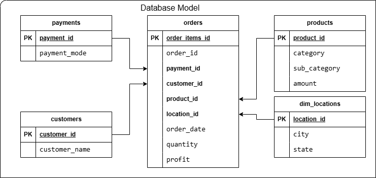
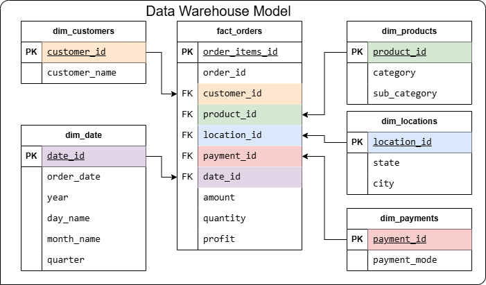

## Sales Intelligence Platform (OLTP → OLAP Data Pipeline)
## Overview

This project builds an end-to-end data pipeline that transforms raw retail sales data into a structured system for analytics.

It demonstrates:

- Data cleaning and transformation (Pandas)
- OLTP and OLAP data modeling
- Data loading into PostgreSQL
- Analytical readiness using a star schema

---
## Problem

Retail data is often fragmented and difficult to analyze due to:

Lack of a centralized data model
Inconsistent formats
Manual reporting processes

This project creates a scalable data foundation for reliable analysis.

---
## Architecture
Raw CSV → Pandas (Cleaning & Transformation) → PostgreSQL  
         → OLTP (Normalized Schema)  
         → OLAP (Star Schema) → Analytics

---
## Data Modeling
### OLTP (Transactional Schema)
- Supports transactional operations
- Tables: customers, products, payments, locations, orders 

### OLAP (Data Warehouse - Star Schema)
- Optimized for analytical queries
- Supports aggregations and reporting
- Fact Table: orders, amount (unit price), quantity, profit
- Dimension Tables: customers, products, locations, payments,dates

---
## ETL Pipeline
1. Data Cleaning (Pandas)
- Standardized column names
- Removed duplicates
- Converted data types
- Generated surrogate keys
2. Transformation
- Built dimension tables
- Merged dimension keys into dataset
- Created fact table
3. Data Loading (PostgreSQL)
- Created schemas: transact (OLTP), flowcart (OLAP)
- Bulk inserts using psycopg2
- Transaction handling with rollback

---

  
   
   
  
   

